  
<h2></h2>
<h1>compte rendu</h1>
<h1>Beidja Cheikh</h1>
<h1>Master SDIA2</h1>
<h1> Event Driven Architecture</h1>
<h1>1.</h1>
<h3>- Télécharger Kafka  </h3>
- 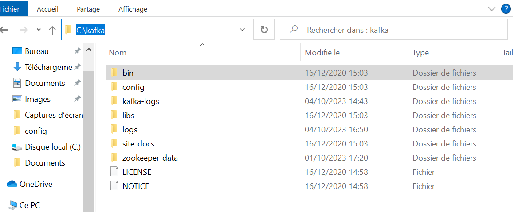  

<h3>- Démarrer Zookeeper   </h3>
- 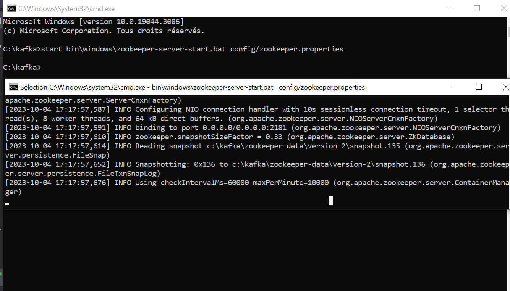  

<h3>- Démarrer Kafka-server  </h3>
- 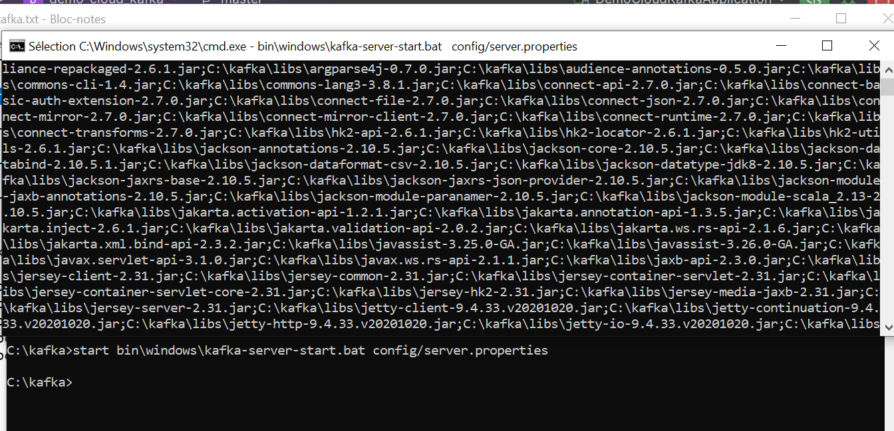  

<h3>- Tester avec Kafka-console-producer et kafka-console-consumer   </h3
- 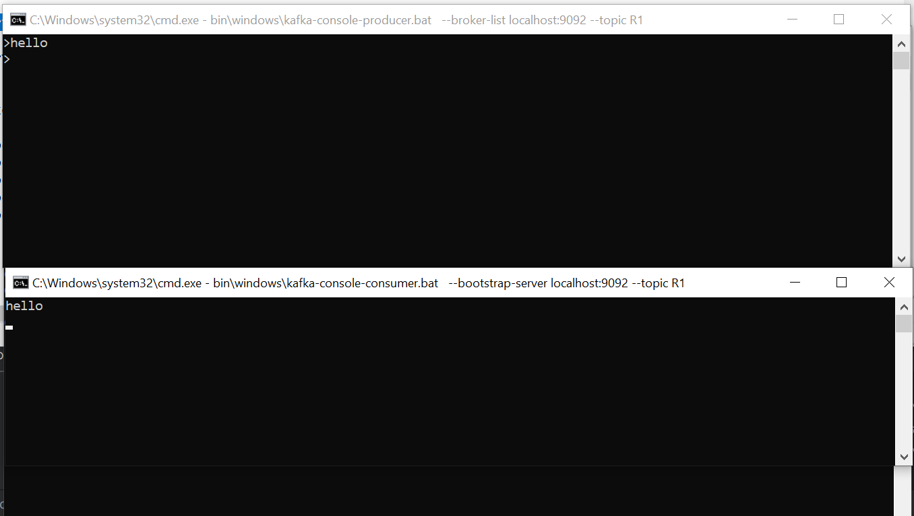  </h3>

<h1>2. Avec Docker (voir https://developer.confluent.io/quickstart/kafka-docker/)
   https://www.youtube.com/watch?v=9O1Kuk2xXO8   </h1>
<h3>- Créer le fichier docker-compose.yml  </h3>
- 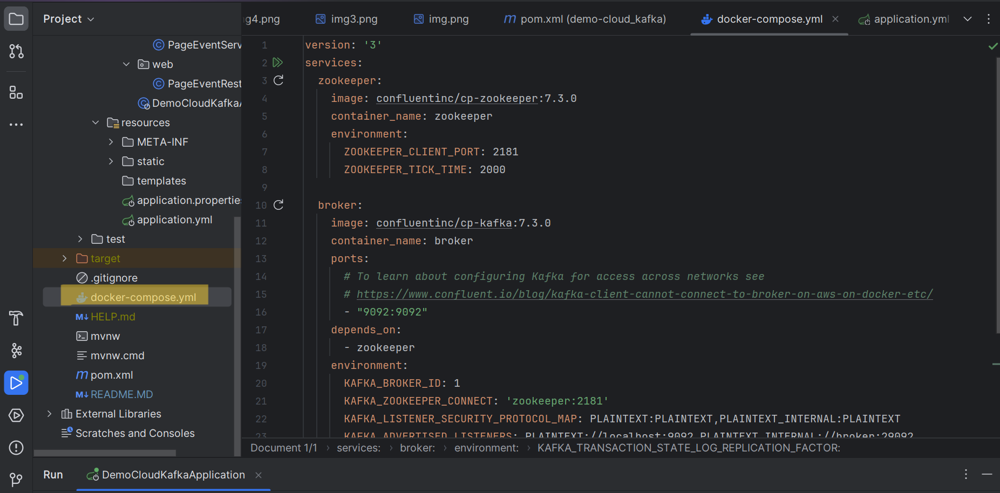  
<h3>- Démarrer les conteneurs docker : zookeeper et kafka-broker  </h3>
-  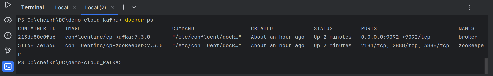
- 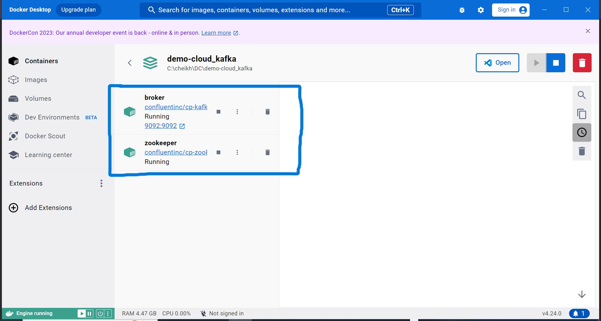
- 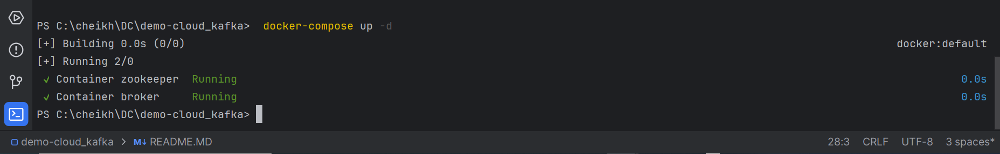  
<h3>- Tester avec Kafka-console-producer et kafka-console-consumer  </h3>
<h3>- Kafka-console-producer</h3>
- 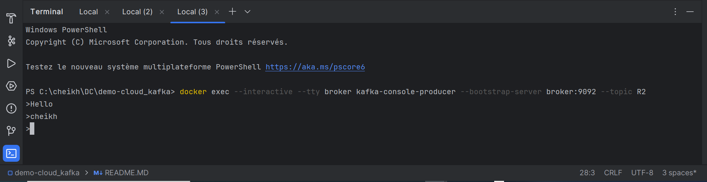  
<h3>- kafka-console-consumer</h3>
- 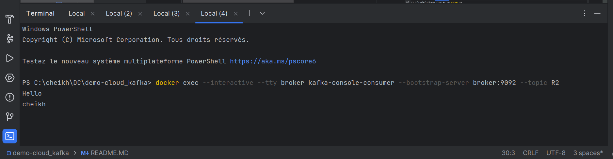  
<h1>3.
En Utilisant KAFKA et Stpring Cloud Streams, Créer :  </h1>
<h3>- Un Service Producer KAFKA via un Rest Controler   </h3>
- 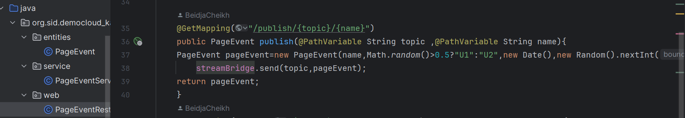  
- 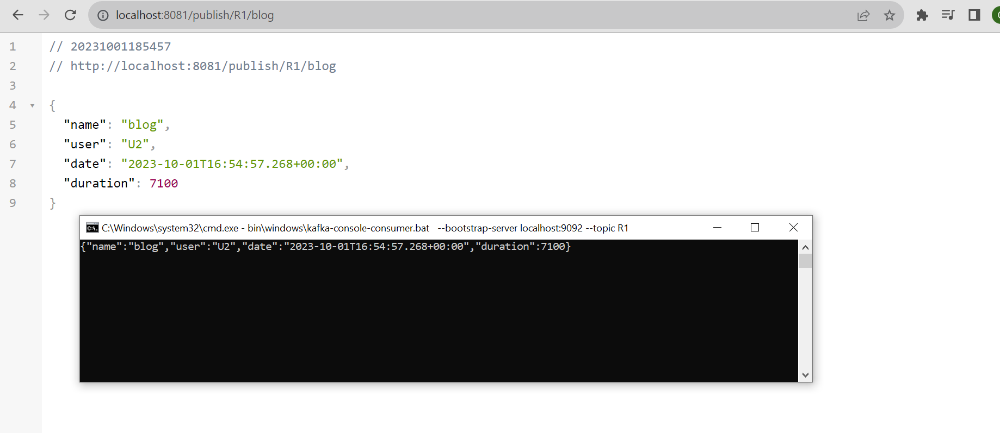  
<h3>- Un Service Consumer KAFKA  </h3>
-   
- 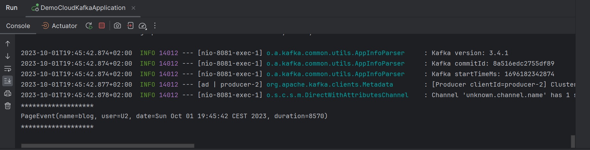  
<h3>- Un Service Supplier KAFKA  </h3>
- 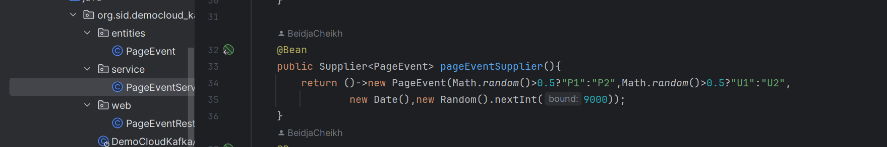  
- 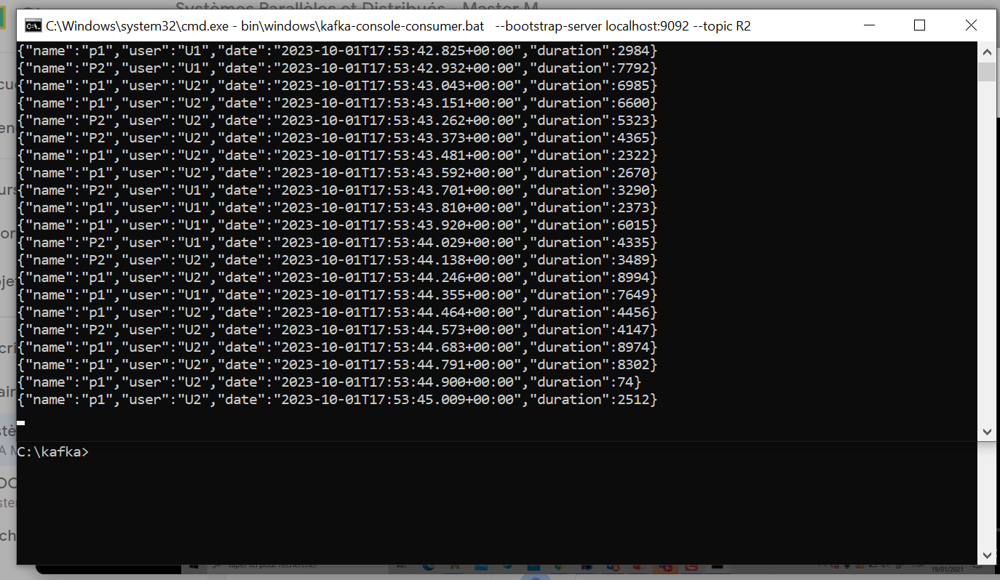  
<h3>- Un Service de Data Analytics Real Time Stream Processing avec Kaflka Streams  </h3>
- 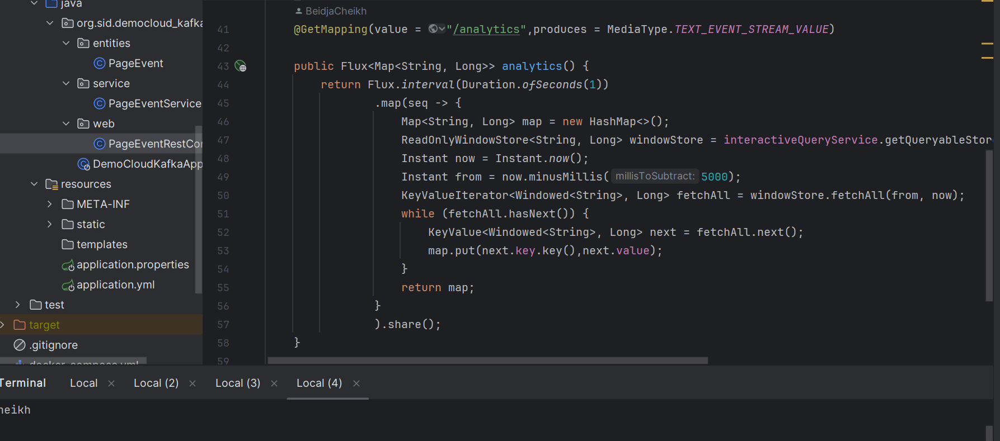  
- 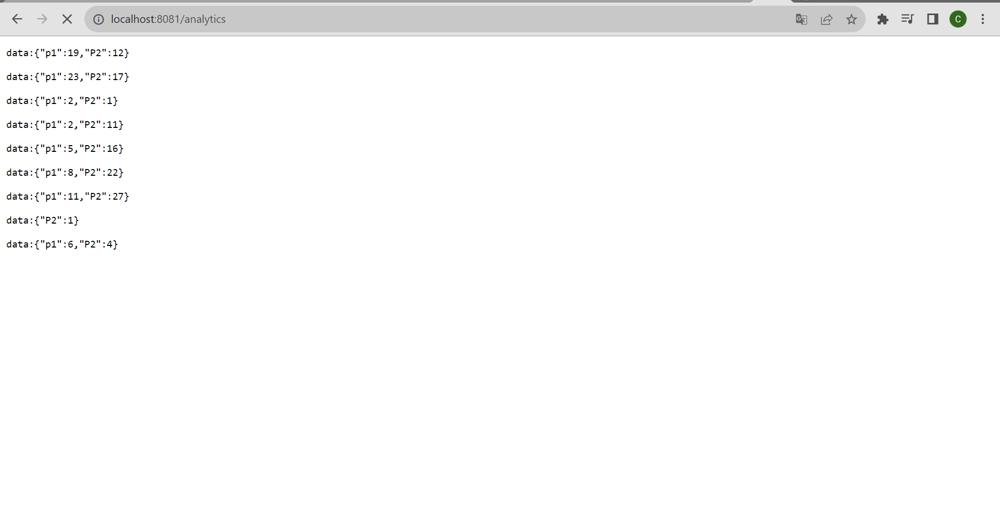  
<h3>- Une application Web qui permet d'afficher les résultats du Stream Data Analytics en temps réel  </h3>
- 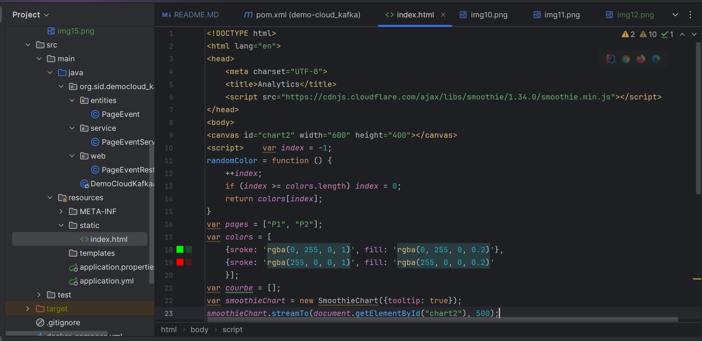  
- 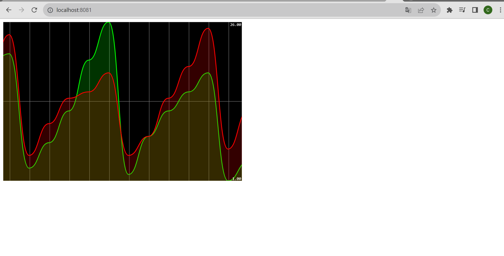  